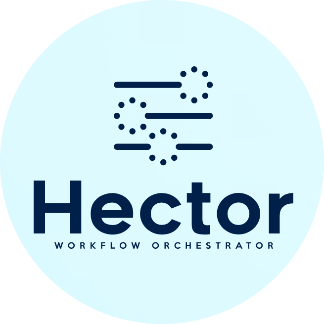

<a name="readme-top"></a>


[![Contributors][contributors-shield]][contributors-url]
[![Forks][forks-shield]][forks-url]
[![Stargazers][stars-shield]][stars-url]
[![Issues][issues-shield]][issues-url]
[![MIT License][license-shield]][license-url]

<!-- PROJECT LOGO -->
<br />
<div align="center">
  <a href="./">
    
  </a>

  <h3 align="center">Hector</h3>

  <p align="center">
    Software tool for workflow orchestration
    <br />
    <a href="./docs"><strong>Explore the docs »</strong></a>
    <br />
    <br />
    <a href="https://github.com/KhaosResearch/Hector/issues">Report Bug</a>
    ·
    <a href="https://github.com/KhaosResearch/Hector/issues">Request Feature</a>
  </p>
</div>


<!-- TABLE OF CONTENTS -->
<details>
  <summary>Table of Contents</summary>
  <ol>
    <li>
      <a href="#about-the-project">About The Project</a>
      <ul>
        <li><a href="#built-with">Built With</a></li>
      </ul>
    </li>
    <li>
      <a href="#getting-started">Getting Started</a>
      <ul>
        <li><a href="#prerequisites">Prerequisites</a></li>
        <li><a href="#installation">Installation</a></li>
      </ul>
    </li>
    <li><a href="#usage">Usage</a></li>
    <li><a href="#roadmap">Roadmap</a></li>
    <li><a href="#contributing">Contributing</a></li>
    <li><a href="#license">License</a></li>
    <li><a href="#contact">Contact</a></li>
  </ol>
</details>


<!-- ABOUT THE PROJECT -->
## About The Project

Hector is a workflow orchestrator. After the insertion of components and specifications, Hector records the optimal grouped topological order for each workflow and controls the execution of definitions associated with them.

<p align="right">(<a href="#readme-top">back to top</a>)</p>


### Built With

Hector has been fully implemented in Golang [![Golang][Golang.com]][Golang-url]. The high performance and great library support surrounding this programming language builds a truly suitable environment for our orchestrator.

<p align="right">(<a href="#readme-top">back to top</a>)</p>


<!-- GETTING STARTED -->
## Getting Started

We show a small guide to clarify the installation of our tool.

### Prerequisites

As a prerequisite it is only necessary to have Golang installed on the system.

```sh
sudo apt install golang-go
```

### Installation

1. Clone repository
   ```sh
   git clone https://github.com/KhaosResearch/Hector.git
   ```
2. Install dependencies
    ```sh
    go mod tidy
    ```

<p align="right">(<a href="#readme-top">back to top</a>)</p>


<!-- USAGE EXAMPLES -->
## Usage

1. Raise the api

    ```sh
    go run cmd/api/main.go
    ```

2. Submit components

    ```sh
    curl -X POST  -H "Accept: Application/json" -H "Content-Type: application/json" -d @data/hector/toy_components/concat_files/concat-files-component.json localhost:8080/component/submit
    curl -X POST  -H "Accept: Application/json" -H "Content-Type: application/json" -d @data/hector/toy_components/concat_messages/concat-messages-component.json localhost:8080/component/submit
    curl -X POST  -H "Accept: Application/json" -H "Content-Type: application/json" -d @data/hector/toy_components/count_letters/count-letters-component.json localhost:8080/component/submit
    ```

3. Submit specification

    ```sh
    curl -X POST  -H "Accept: Application/json" -H "Content-Type: application/json" -d @data/hector/toy_specifications/toy_specification_1.json localhost:8080/specification/submit
    ```

4. Execute definition

    ```sh
    curl -X POST  -H "Accept: Application/json" -H "Content-Type: application/json" -d @data/hector/toy_definitions/toy_definition_1.json localhost:8080/definition/execute
    ```

5. Get result info (Replace <definition_id> with the identifier returned in console)

    ```sh
    curl -X GET -i -H "Accept: application/json" -H "Content-Type: application/json"  localhost:8080/result/get/<definition_id>
    ```

<p align="right">(<a href="#readme-top">back to top</a>)</p>


<!-- CONTRIBUTING -->
## Contributing

Contributions are what make the open source community such an amazing place to learn, inspire, and create. Any contributions you make are **greatly appreciated**.

If you have a suggestion that would make this better, please fork the repo and create a pull request. You can also simply open an issue with the tag "enhancement".
Don't forget to give the project a star! Thanks again!

1. Fork the Project
2. Create your Feature Branch (`git checkout -b feature/AmazingFeature`)
3. Commit your Changes (`git commit -m 'Add some AmazingFeature'`)
4. Push to the Branch (`git push origin feature/AmazingFeature`)
5. Open a Pull Request

<p align="right">(<a href="#readme-top">back to top</a>)</p>


<!-- LICENSE -->
## License

Distributed under the MIT License. See `LICENSE.txt` for more information.

<p align="right">(<a href="#readme-top">back to top</a>)</p>

<!-- CONTACT -->
## Contact

Adrián Segura Ortiz - adrianseor.99@gmail.com

Project Link: [https://github.com/KhaosResearch/Hector](https://github.com/KhaosResearch/Hector)

<p align="right">(<a href="#readme-top">back to top</a>)</p>


<!-- MARKDOWN LINKS & IMAGES -->
<!-- https://www.markdownguide.org/basic-syntax/#reference-style-links -->
[contributors-shield]: https://img.shields.io/github/contributors/KhaosResearch/Hector.svg?style=for-the-badge
[contributors-url]: https://github.com/KhaosResearch/Hector/graphs/contributors
[forks-shield]: https://img.shields.io/github/forks/KhaosResearch/Hector.svg?style=for-the-badge
[forks-url]: https://github.com/KhaosResearch/Hector/network/members
[stars-shield]: https://img.shields.io/github/stars/KhaosResearch/Hector.svg?style=for-the-badge
[stars-url]: https://github.com/KhaosResearch/Hector/stargazers
[issues-shield]: https://img.shields.io/github/issues/KhaosResearch/Hector.svg?style=for-the-badge
[issues-url]: https://github.com/KhaosResearch/Hector/issues
[license-shield]: https://img.shields.io/github/license/KhaosResearch/Hector.svg?style=for-the-badge
[license-url]: https://github.com/KhaosResearch/Hector/blob/master/LICENSE.txt
[Golang.com]: https://img.shields.io/badge/Go-mod
[Golang-url]: https://go.dev/